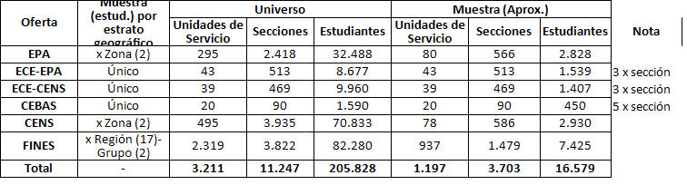

## Introducción

El objetivo es realizar una muestra representativa de los estudiantes jóvenes, adultos y adultos mayores (EJAyAM) que asisten, en 2026, a establecimientos de dependencia oficial en la provincia de Buenos Aires. Como se verá a lo largo de esta sección, esta aplicación en interesante porque, entre otras cuestiones:

- Tensiona la percepción de los dominios de estimación como sinónimos de los estratos de una muestra.

- En parte relacionado con el punto anterior, es que se verá de forma explícita las virtudes de distinguir entre los objetivos o fines de la muestra con los modos o medios para cumplir con ellos.

- Por último, se verá que, al menos al principio o *a priori*, no queda claro que "medios", dentro de los disponibles para lograr los "fines" propuestos, es/será el más conveniente.

El presente diseño muestral, a diferencia de @sec-muestra_peb_2025, no tiene que ser compatible o mejorar en algunos puntos específicos de un diseño muestral anterior. Por otro lado, en este caso sí hay exigencias o restricciones específicas en cuanto a la precisión estadística del resultado esperado. En otras situaciones relativamente similares, esas exigencias/restricciones se explicitan o se traducen en términos de costo operativo o económico del estilo "Nosotros podemos/queremos una muestra de X casos" o "Recolectar tal tipo de caso nos cuesta más que tal u otro así que, en lo posible, tenga eso en cuenta dentro del diseño".

En cualquier caso, siempre es importante distinguir cuales son los objetivos, cuales son las restricciones y cuales son los márgenes de maniobra para obetener una solución relativamente óptima al problema [@valliant2018, cap. 5].

## Objetivos

Expresado en el lenguaje clásico de los márgenes de error, la precisión de los resultados con la se espera poder realizar inferencias son en general de:

- Nivel de confianza: 90%

- $P$: 50%

Sin embargo, la complejidad de esta muestra es que, con estos supuestos de fondo, los márgenes de error que se piden son diversos para diferentes subpoblaciones que surguen o se construyen, muchas veces, mediante el cruce entre otras variables. Para peor, algunos de esos cruces implican variables que podrían considerarse como jerárquicas (p.e. Región y Distrito) lo que plantea problemas particulares. Finalmente, en el pedido original, y bajo la forma del lenguaje de los estratos, se afirma que estos son una combinación de estratos de "oferta" (p.e. FINES, EPA, etc.) y de "zonas" (p.e. regiones, grupo de regiones, etc.). En ese contexto se pide lo siguiente:

- Sobre los establecimientos FINES a nivel regional con un margen de error del 5%.

- En el resto de los establecimientos (EPA y CENSA) se espera poder hacer inferencias a nivel de Gran Área con un margen de error del 3%.

- En el caso de los CEBAS, dado su pequeño tamaño poblacional, se espera realizar un relevamiento censal. Por esta razón no habrá márgen de error para esta categoría.

Si se asume que los diferentes tipos de establecimientos son "Estratos" de la oferta, se podría pensar que se aspira a un margen de error de:

3% por estrato-Gran Área,

4% por estrato-región agrupada.

5% por estrato-región

La idea que está por detrás de esto último es que, a mayor nivel de agregación geografica o espacial, se espera uan reducción del margen de error.

Por ahora no diremos algo más específico con referencia a los medios para lograr ese objetivo. La razón de esto es, justamente, distinguir los objetivos del estudio de los medios para lograrlos. Incluso más adelante vamos a proponer una manera alternativa de proponer los objetivos de la muestra basada en el léxico del coeficiente de variación (*CV*) que puede considerarse como un error estándar relativo [@valliant2018, pág. 3]. El cómo enunciar los objetivos de una muestra no algo banal. En efecto, suele haber diferencias entre las disciplinas a la hora de que pedirle a una muestra. Por ejemplo, en contextos epidemiológicos es usual hablar de *power requirements* aunque lo usual en las ciencias sociales es hablar sobre *precision goals* [@valliant2018, pág. 8].

Para esto se espera realizar un diseño muestral polietápico en donde en una primera etapa seleccione a los establecimeintos y luego a los estudiantes que concurren a ellos.

Los estudiantes pueden pertenecer a los siguientes **tipos de establecimientos**:

- Nivel Primario. Se incluyen solo a los EPA. Se excluyen a los centros de alfabetización y a los CEPA.

- Nivel Secundario de oferta institucional. Estos pueden ser CENS o SEBAS.

- Nivel Secundario por fuera de la oferta institucional. Son los establecimientos FINES.

```{r}
#| label: setup_libraries

library(tidyverse)
library(here)
library(plotly)
library(PracTools)
library(tmap)
library(readxl)
library(janitor)
library(gt)
library(gtsummary)
library(sf)
library(srvyr)
library(survey)
library(patchwork)
library(BalancedSampling)
library(rsamplr)

i_am("muestra_adultos.qmd")

theme_gtsummary_language(
language = "es",
decimal.mark = ",",
big.mark = ".")
```

```{dot}
//| label: fig-tipos_establecimientos
//| fig-cap: "Establecimientos de educación adulta y población objetivo"
//| fig-width: 5
digraph G {
    // Configuración para orientación horizontal (Left to Right)
    rankdir=LR;
    // Configuración visual por defecto para que se parezca a las cajitas de Mermaid
    node [shape=box, style=filled, fillcolor="#f5f5f5", fontname="Arial", fontsize=11];
    edge [fontname="Arial", fontsize=10];
    // Nivel 1: Raíz (Con el estilo de color que definiste)
    nivel [label="Establecimientos educ. adulta y\n depedencia oficial", fillcolor="#ffe6cc", color="#d79b00", penwidth=2];
    // Nivel 2: Primario y Secundario
    // (En Mermaid los paréntesis hacen bordes redondeados; en Graphviz usamos Mrecord o simplemente box)
    primario [label="Nivel Primario"];
    secundario [label="Nivel Secundario"];
    nivel -> primario;
    nivel -> secundario;
//Nivel Primario
  
    alfabetización [label="C. Alfabetización"];
    
    primario -> alfabetización[minlen=2];
    primario -> CEPA[minlen=2];
    primario -> epa[minlen=2];
    epa [label="EPA", fillcolor="#ffe6cc"];
// Nivel Secundario
    institucional [label="Oferta \nInstitucional"];
    no_institucional [label="Por fuera de la \nOferta Institucional"];
    secundario -> institucional;
    secundario -> no_institucional;
// Nivel 4: Destinos finales
    cens [label="CENS", fillcolor="#ffe6cc"];
    cebas [label="CEBAS", fillcolor="#ffe6cc"];
    fines [label="FinEs", fillcolor="#ffe6cc"];
    institucional -> cens;
    institucional -> cebas;
    no_institucional -> fines;
# Enlace invisible en Graphviz (Equivalente al ~~~ de Mermaid)
    // Mantiene a 'primario' arriba de 'cens', este arriba de 'cebas', etc.
    primario -> epa -> cebas -> cens -> fines [style=invis, constraint=false];
}
```

## Resultados esperados

Encuesta de perfil de lxs estudiantes de la modalidad de EJAyAM

Población objetivo: Estudiantes EPA (solo sedes) de nivel Primario y de todas las ofertas de nivel Secundario (CENS, CEBAS, FINES) de gestión estatal (oficial).

Diseño de la muestra

-Tipo de muestreo: estratificado polietápico y por conglomerados con selección proporcional al tamaño y sistemática

-Estratos:

Por oferta (EPA, CENS, CEBAS, FINES) y

por área:

1\) CEBAS: Censal •

2\) EPA y CENS: AMBA (R01 a R11) e Interior (R12 a R25) •

3\) FINES: Por región o agregado de regiones (16, 21, 22 y 23; 15, 17, 24 y 25).

-Etapas de selección: •

1° Unidades de servicios / Sedes: Proporcional al tamaño (matrícula), con orden sistemático por IVSE-T. •

2° Secciones: Todas las secciones de los establecimientos seleccionados. •

3° Estudiantes: 5 primeros o últimos de cada sección.

### Tamaño de la muestra

deff=2 para EPA y CENS

deff= 1,5 para FINES y CEBAS.

Se estima la realización de unas 14.000 encuestas (algo más de 7.000 en FINES, cerca de 3.000 en EPA y CENS y 600 en CEBAS) en aproximadamente 2.700 secciones (cerca de 1/4 del total).

El margen de error para el total provincial sería del 1% para FINES, del 2% para EPA y CENS y del 3% para CEBAS, ubicándose en torno al 1,2% para el total del nivel secundario y del total de ambos niveles de la modalidad.



## Afinando la población objetivo

Más allá que se cuente previamente o se construya especialmente para la ocasión, siempre es importante saber el origen del marco muestral. La indagación sobre este punto no solo aclara que entra dentro de él, sino también que queda fuera de él y porque. En este sentido, no es lo mismo que el marco muestral deje afuera algo deseado, pero impráctico de obtener que, por otro lado, algo que si bien desde lejos parecía cercano a la población objetivo, desde el principio se prefirió no incluir. En el primer caso, se mantiene la definición intensiva de la población objetivo, pero se restringue la extensión empírica del marco muestral creando una distancia entre uno y otro. En el segundo caso, lo que se cambia/ajusta es la definición de la población objetivo y se evita una distancia entre lo deseado/buscado y lo realizable con el marco muestral disponible.

Aplicado lo anterior al presente problema, la cuestión es discernir a qué tipo de estudiante se desea alcanzar y a cuáles no. A primera vista se puede suponer que la población objetivo (*target population*) son los estudiantes **adultos** de nivel primario y secundario de la provincia de Buenos Aires.

```{r}
#| label: insumos_muestra

df_establecimientos_2026 = read_xlsx(here("Inputs", "Nómina de establecimientos 20260320.xlsx")) |>
clean_names()

# Esto después se tiene que actualizar
df_universo = read_xlsx(here("Inputs", "muestra_adultos", "Muestra Encuesta DEJAyAM 2026-260604.xlsx")) |>
clean_names() |>
mutate(tipo_est_adulto = case_when(
tipo_de_organizacion == "CENTRO EDUCATIVO DE NIVEL SECUNDARIO (C.E.N.S.)" ~ "CENS",
tipo_de_organizacion == "CENTRO DE EDUCACIÓN PRIMARIA DE ADULTOS" ~ "CEPA",
tipo_de_organizacion == "ESCUELA DE EDUCACIÓN PRIMARIA DE ADULTOS" ~ "EPA",
tipo_de_organizacion == "CENTRO DE ALFABETIZACIÓN" ~ "ALFABETIZACION",
tipo_de_organizacion == "ESCUELA DE EDUCACIÓN SECUNDARIA" ~ "ESC. EDU. SECUNDARIA",
tipo_de_organizacion == "ESCUELA DE EDUCACIÓN MEDIA" ~ "ESC. EDU. MEDIA",
tipo_de_organizacion == "CENTRO ESPECIALIZADO PARA ADULTOS CON ORIENTACIÓN EN SALUD (CEBAS)" ~ "CEBAS",
tipo_de_organizacion == "SEDE FINES" ~ "FINES",
.default = "NULL")) |>
rename(population_target = universo) |>
mutate(population_target = if_else(population_target == 0, "NO", "SI"))

# Después se agregó la dimensión encierro

df_universo = df_universo |>
mutate(encierro = if_else(
str_detect(estrato_oferta, "ECE"), "SI", "NO")) |>
relocate(encierro, .after = nivel)

df_establecimientos_indicadores = suppressWarnings(read_excel(here(
    "inputs",
    "Nomina - Vulnerabilidad Octubre 2025.xlsx"
))) |>
    clean_names() |>
    select(
        clave,
        nivel,
        media_250m_ivse_t,
        icse_valor_en_250m,
        auh_valor_en_250m,
        organizacion
    ) |>
    rename(organizacion_base_indicadores = organizacion)

# Abro archivo espacial. Cambio nombre de departemto a distrito.
# paso el texto de distrito todo a mayúsculas y sin acentos. Hay que hacerlo con regex. Existen funciones
df_sf_distritos = read_rds(here("Inputs", "tb_depto_geom_pol.rds")) |>
rename(distrito = departamento) |>
mutate(distrito = str_to_upper(distrito)) |>
mutate(distrito = str_replace_all(distrito, "Á", "A")) |>
mutate(distrito = str_replace_all(distrito, "É", "E")) |>
mutate(distrito = str_replace_all(distrito, "Í", "I")) |>
mutate(distrito = str_replace_all(distrito, "Ó", "O")) |>
mutate(distrito = str_replace_all(distrito, "Ú", "U"))

# cambio alguno nombres a mano

df_sf_distritos = df_sf_distritos |>
mutate(distrito = case_when(
distrito == "3 DE FEBRERO" ~ "TRES DE FEBRERO",
distrito == "CANUELAS" ~ "CAÑUELAS",
distrito == "CORONEL ROSALES" ~ "CORONEL DE MARINA L. ROSALES",
distrito == "JUAREZ" ~ "BENITO JUAREZ",
distrito == "GENERAL LAMADRID" ~ "GENERAL LA MADRID",
distrito == "GONZALES CHAVES" ~ "ADOLFO GONZALES CHAVES",
distrito == "GENERAL MADARIAGA" ~ "GENERAL JUAN MADARIAGA",
TRUE ~ distrito
))

```

Sin embargo, como se observa en @tbl-poblacion_objetivo, existen una serie de establecimientos de educacion de jóvenes y adultos que quedan por fuera de la población objetivo de esta muestra. Más concretamente, existe un 19% que no posee todas las características necesarias.

```{r}
#| label: tbl-poblacion_objetivo
#| tbl-cap: Población objetivo dentro del universo de establecimiento de educación adulta

tbl_poblacion_objetivo = df_universo |>
select(population_target) |>
tbl_summary(
           sort = all_categorical() ~ "frequency",
           label = list(population_target = "Población Objetivo"),
           percent = "column")
tbl_poblacion_objetivo

```

Entre las características que se tuvieron en cuenta se encuentran en la confección de la población objetivo se encuentra la dependencia y el tipo de establecimiento. Como se observa en @tbl-poblacion_objetivo_criterios todos los establecimientos de la población objetivo son de dependencia oficial. Dada que la presencia de otros tipos de dependencia en la educación adulta es muy baja, este criterio no es crítico desde el punto de vista empírico.

Esto no significa que todos los establecimientos de dependencia oficial pertenecen a la población objetivo. En efecto, existe un 19% de establecimientos de dependencia oficial que no pertenecen a la población objetivo. Dentro del nivel primario, se trata de los establecimientos CEPA (671) y los centros de alfabetización (45) y dentro del nivel secundario de aquellos establecimientos denominados "Escuelas de educación media o secundaria". Los que sí entran a la población objetivo, siempre que sean de dependencia oficial, son los establecimientos FINES, los CENS, los EPA y los CEBAS.

```{r}
#| label: tbl-poblacion_objetivo_criterios
#| tbl-cap: Distribución de tipos de establecimiento de educación adulta

tbl_poblacion_objetivo_criterios = df_universo |>
select(population_target, tipo_est_adulto, dependencia) |>
tbl_summary(by = population_target,
           sort = all_categorical() ~ "frequency",
           label = list(tipo_est_adulto = "Tipo de establecimiento",
                        dependencia = "Dependencia"),
           percent = "row") |>
add_overall() |>
modify_spanning_header(c("stat_1", "stat_2") ~ "**Población Objetivo**") 

tbl_poblacion_objetivo_criterios
```

Dado que se cuenta con un marco muestral flexible en el cual ya se han detectado que establecimientos podrían entrar en la muestra, lo interesante es ajustar la población objetivo al marco muestral entregado. No se trata de un simple juego de palabras. Si se detectan o sospechan diferencias apreciables entre la población objetivo y el marco muestral, antes o después, será aconsejable realizar alguna intervención para corregir o aminorar esa distancia. En cambio, si el marco muestral se ajusta a la población objetivo algunas de las anteriores intervenciones no serán necesarias o recomendadas.

Sin embargo, ahora veremos que en realidad se trata de una subpoblación más específica porque la población que finalmente tiene posibilidades de entrar a la muestra es un subconjunto de aquel conjunto. Y dada que contamos con un marco muestral flexible la razón de no inclusión no es por falta de información en el marco.

Esto hace que el investigador concentre las energías en otras partes de la investigación. En

## Marco muestral {#sec-marco_muestral_adultos}

Una vez definida la población objetivo comenzamos a mejorar el marco muestral. Decimos que comenzamos a "mejorar" porque, por suerte, ya tenemos un marco muestral básico que nos permite identificar a las unidades de selección primarias (*PSU* en inglés). Decimos "por suerte" porque una característica particularmente interesante de trabajar en grandes organizaciones, que no es lo usual por fuera de ellas, es la posibilidad de trabajar con un marco muestral (*sampling frame*) que se ajuste bastante bien a la población objetivo (*population target*). Por ejemplo, en una universidad o colegio podemos tener un listado de estudiantes relativamente actualizado. En cambio, en otro tipo de investigaciones, los investigadores suelen dedicar un tiempo considerable a conseguir un marco muestral que o bien sobrerrepresente o subrepresente empíricamente a la población objetivo. Cabe recordar que el marco muestral no es solo una lista de elementos a seleccionar sino también alguna información que ayude a su contacto/localización. Tener una lista de DNI para cada uno de los miembros del marco muestral es una ayuda, pero no es muy útil si esa información no viene anexada con algún dato que permita contactar/localizar a los DNI efectivamente seleccionados en la muestra.

Al pasar antes dijimos que el marco muestral básico con el que vamos a trabajar nos permite identificar a las unidades de selección primarias. En otras palabras, vamos a trabajar con un listado de establecimientos y no de estudiantes y vamos a desarrollar un muestreo polietápico en donde en primera instancia (de ahí lo de unidades "primarias") se seleccionan establecimientos y recien luego se seleccioan secciones y/o estudiantes.

Para la selección de las unidades de seleccion, existen dos tipos generales de marcos muestrales: directos e indirectos [@valliant2018, pág. 6]. Los marcos muestrales que contienen una lista de las unidades de observación finales se denominan **marcos directos**. Estos marcos facilitan/permiten los diseños de una sola etapa. Por ejemplo, si se tiene una lista de estudiantes y algún contacto virtual (p.e. mail), se puede realizar un diseño en una sola etapa. En ese caso, no será necesario seleccionar primero a unidades de selección primarias como, por ejemplo, los establecimientos educativos.

Los **marcos indirectos**, en cambio, requieren de mucha menor información, pero permiten realizar la selección de las unidades de selección primarias (*clusters* o conglomerados) y se utilizan en diseños polietápicos. Los marcos indirectos necesariamente se usan en diseños polietápicos, pero los marcos directos se pueden usar tanto en diseños de una sola etapa o, vía agregación de su información, en diseños polietápicos.

Volviendo a nuestro marco muestral el mismo es del tipo indirecto y, suponemos, que es de una muy buena calidad en términos de su ajuste a la población objetivo. Sin embargo, ahora veremos con mayor detalle la información auxiliar que tendremos de las covariables presente en él, para sí poder realizar un mejor diseño muestral.

```{r}
#| label: sampling_frame
# Construyo variables y aclaro el tipo de dato
df_sampling_frame = df_universo |>
filter(population_target == "SI") |>
rename(matricula = matricula_total,
       ambito = ambito_geografico,
       region = region_educativa,
       ivse = ivse_t,
       distrito_n = codigo_distrito_dg_cy_e,
       distrito = nombre_de_distrito_partido,
       dominio = estrato,
       criterio_seleccion = criterios_seleccion_sede) |>
mutate(estudiante_seccion = matricula / secciones,
       nivel = if_else(nivel == "Nivel Secundario (FINES)", "Secundario", "Primario"),
       region_n = as.numeric(region),
       distrito_n = as.numeric(distrito_n),
       area = case_when(
region_n == 1 ~ "INTERIOR",
region_n == 2 ~ "CONURBANO",
region_n == 3 ~ "CONURBANO",
region_n == 4 ~ "CONURBANO",
region_n == 5 ~ "CONURBANO",
#distrito == "Ezeiza" ~ "CONURBANO",
#distrito == "Almirante Brown" ~ "CONURBANO",
#distrito == "Esteban Echeverría" ~ "CONURBANO",
#distrito == "Presidente Perón" ~ "INTERIOR", # PTE PERON
#distrito == "San Vicente" ~ "INTERIOR", # SAN VICENTE
region_n == 6 ~ "CONURBANO",
region_n == 7 ~ "CONURBANO",
region_n == 8 ~ "CONURBANO",
region_n == 9 ~ "CONURBANO",
region_n >= 10 ~ "INTERIOR",
.default = "NA")) |>
mutate(area = if_else(area == "CONURBANO", "AMBA", "INTERIOR"),
region_agrupada = case_when(
region == "16" ~ "16-21-22-23",
region == "21" ~ "16-21-22-23",
region == "22" ~ "16-21-22-23",
region == "23" ~ "16-21-22-23",
region == "15" ~ "15-17-24-25",
region == "17" ~ "15-17-24-25",
region == "24" ~ "15-17-24-25",
region == "25" ~ "15-17-24-25",
.default = region)) |>
relocate(area, .after = distrito) |>
relocate(region_n, .after = region) |>
relocate(distrito_n, .after = distrito) |>
relocate(region_agrupada, .after = region_n)

df_sampling_frame = df_sampling_frame |>
mutate(distrito = str_to_upper(distrito)) |>
mutate(distrito = str_replace_all(distrito, "Á", "A")) |>
mutate(distrito = str_replace_all(distrito, "É", "E")) |>
mutate(distrito = str_replace_all(distrito, "Í", "I")) |>
mutate(distrito = str_replace_all(distrito, "Ó", "O")) |>
mutate(distrito = str_replace_all(distrito, "Ú", "U"))

levels_region = c("01", "02", "03", "04", "05", "06", "07", "08", "09","10", "11", "12", "13", "14", "15", "16", "17", "18", "19", "20", "21", "22", "23", "24", "25")
levels_area = c("AMBA", "INTERIOR")
levels_ambito = c("Urbano", "Rural Agrupado", "Rural Disperso")
levels_encierro = c("SI", "NO")

df_sampling_frame = df_sampling_frame |>
mutate(region = fct_relevel(region, levels_region),
       area = fct_relevel(area, levels_area),
       ambito = fct_relevel(ambito, levels_ambito),
       encierro = fct_relevel(encierro, levels_encierro))

write_rds(df_sampling_frame,
         here("Inputs", "df_sampling_frame.rds"))

```

```{r}
#| label: tbl-sampling_frame
#| tbl-cap: Características del marco muestral

tbl_sampling_frame = df_sampling_frame |>
slice_head(n = 15) |>
gt() |>
tab_style(
    style = cell_text(whitespace = "nowrap"),
    locations = cells_body()) |>
tab_options(
    data_row.padding = px(0.5),    # Reduce el espacio vertical en las filas de datos
    column_labels.padding = px(2),
    table.font.size = "small"# También puedes reducir el espacio en los encabezados
  )

tbl_sampling_frame
```

Como vemos tenemos información auxiliar a nivel de cada establecimiento tanto de variables discretas como continuas:

Variables discretas:

- Distrito

- Región

- Región Agrupada

- Ámbito

- Área

- Nivel

- Tipo de establecimiento

- Condición de encierro

Variables continuas:

- Matrícula

- Secciones

- Media de estudiantes por sección

- índice de vulnerabilidad socioecómico - IVSE

Para tener una idea de las distribuciones de estas variables vamos a realizar un análisis exploratorio de datos. Para esto, vamos a realizar un análisis descriptivo de cada una de las variables discretas y continuas tanto a nivel de establecimientos como a nivel de los estudiantes. Para las variables discretas vamos a mostrar su distribución en términos de frecuencias y porcentajes. Para las variables continuas, vamos a mostrar su distribución a través de histogramas o gráficos de densidad.

```{r}
#| label: tbl_explo_marco_establecimientos
#| tbl-cap: Análisis exploratorio variables discretas - Nivel establecimientos
# Las tablas con gtsummary y los gráficos con ggplot y luego ggploly para hacerlo interactivo
tbl_explo_marco_establecimientos = df_sampling_frame |>
select(region, region_agrupada, ambito, area, nivel, tipo_est_adulto, matricula, secciones, estudiante_seccion, encierro, ivse) |>
tbl_summary(
           label = list(region = "Región",
                        region_agrupada = "Región Agrupada",
                        ambito = "Ámbito",
                        area = "Gran Área",
                        nivel = "Nivel",
                        secciones = "Secciones",
                        matricula = "Matrícula",
                        tipo_est_adulto = "Tipo de establecimiento",
                        estudiante_seccion = "Estudiante por sección",
                        encierro = "Condición de encierro",
                        ivse = "IVSE")
         )

```

```{r}
#| label: fig_explo_marco_establecimientos
#| fig-cap: Análisis exploratorio variables continuas - Nivel establecimientos
# graficar con ggplot y ggplotly
fig_explo_marco_establecimientos = df_sampling_frame |>
select(matricula, secciones, estudiante_seccion, ivse) |>
pivot_longer(cols = everything(), names_to = "variable", values_to = "valor") |>
ggplot(aes(x = valor)) +
geom_histogram(bins = 30, fill = "#69b3a2", color = "#e9ecef", alpha = 0.9) +
facet_wrap(~ variable, scales = "free_x", ncol = 4) +
theme_minimal() +
labs(title = "Establecimientos",
x = "Valor",
y = "Frecuencia")   
```

```{r}
#| label: df_estudiantes
df_estudiantes = df_sampling_frame |>
uncount(weights = matricula, 
        .remove = FALSE,
        .id = "id_estudiante_establecimiento")

N_estudiantes = nrow(df_estudiantes)

write_rds(df_estudiantes,
          here("inputs", "df_estudiantes.rds"))

```

```{r}
#| label: tbl_explo_marco_estudiantes 
#| tbl-cap: Análisis exploratorio variables discretas - Nivel estudiantes 
# Las tablas con gtsummary y los gráficos con ggplot y luego ggploly para hacerlo interactivo 

df_estudiantes = read_rds(here("inputs", "df_estudiantes.rds"))
tbl_explo_marco_estudiantes = df_estudiantes |> 
  select(region, region_agrupada, ambito, area, nivel, tipo_est_adulto, matricula, secciones, estudiante_seccion, encierro, ivse) |> 
  tbl_summary(sort = all_categorical() ~ "frequency", 
  label = list(region = "Región", 
  region_agrupada = "Región Agrupada", 
  ambito = "Ámbito", 
  area = "Gran Área", 
  nivel = "Nivel", 
  encierro = "Condición de encierro", 
  secciones = "Secciones", 
  matricula = "Matrícula", 
  tipo_est_adulto = "Tipo de establecimiento", 
  estudiante_seccion = "Estudiante por sección", 
  ivse = "IVSE"))
```

```{r}
#| label: fig_explo_marco_estudiantes
#| fig-cap: Análisis exploratorio variables continuas - Nivel establecimientos
# graficar con ggplot y ggplotly
fig_explo_marco_estudiantes = df_estudiantes |>
select(matricula, secciones, estudiante_seccion, ivse) |>
pivot_longer(cols = everything(), names_to = "variable", values_to = "valor") |>
ggplot(aes(x = valor)) +
geom_histogram(bins = 30, fill = "#69b3a2", color = "#e9ecef", alpha = 0.9) +
facet_wrap(~ variable, scales = "free_x", ncol = 4) +
theme_minimal() +
labs(title = "Estudiantes",
x = "Valor",
y = "Frecuencia")
```

Como puede observarse en @tbl-comparacion, de las 25 regiones, algunas poseen menos del 1% de los estudiantes (p.e. 16, 17, 21, 23). Estas regiones son buenas candidatas para agruparse con otras regiones para facilitar la estimación en subpoblaciones espaciales. Eso es lo que se hace con la variable "Región agrupada" que logra el modesto avance de que las regiones más pequeñas en términos de estudiantes sean la 13 (1.4%) y la 20 (1.6%).

Para lo que respecta a los dominios de estimacion (@sec-adultos_dominios_estimacion) la agregación de "Gran Área" no parece mostrar una agrupación muy desbalanceada (58% vs. 42%). Esto asegura, en la práctica, que con una buena representación de la variable "Región Agrupada" en el camino también se obtiene una aceptable distribución de la variable "Gran Área".

En cuanto a la variable "Tipo de establecimiento" se observa la siguiente distribución. La situación más problemática parece ser los CEBAS que poseen menos del 1% de los estudiantes. A diferencia que con las regiones, con los tipos de establecientos no es posible una agregació mayor

En cuanto a los niveles tampoco parece haber mayores problemas aunque, estrictamente, esta variable no está incluida dentro de los dominios de estimación.

```{r}
#| label: tbl-comparacion
#| tbl-cap: Comparación exploratorio del marco muestral. Nivel establecimieno y nivel estudiantes
tbl_comparacion_establecimientos_estudiantes = tbl_merge( 
 tbls = list(tbl_explo_marco_establecimientos, 
             tbl_explo_marco_estudiantes),
    tab_spanner = c("**Establecimientos**", "**Estudiantes**")
  )

tbl_comparacion_establecimientos_estudiantes
```

```{r}
#| label: fig-comparacion
#| fig-cap: Comparación exploratorio del marco muestral. Nivel establecimieno y nivel estudiantes

fig_comparacion_establecimientos_estudiantes = fig_explo_marco_establecimientos / fig_explo_marco_estudiantes

fig_comparacion_establecimientos_estudiantes
```

```{r}
#| label: fig_mapa_distritos
#| fig-cap: Mapa según distrito. Color según matrícula.
# Quiero realizar un mapa con tmap en version "view" con las coordenadas de los distritos (columan geom_depto) y la cantidad de estudiantes por distrito (matricula). Para esto, tengo que agrupar el dataframe por distrito y sumar la cantidad de estudiantes por distrito. Luego, tengo que unir el dataframe con el dataframe espacial de los distritos para poder graficar el mapa.
tmap_mode("view")
# Le agrego la geometría de los distritos. No lo agrego antes para no saturar a df_estudiantes

insumo_mapa_distritos = df_sampling_frame |>
left_join(df_sf_distritos, by = "distrito") |>
relocate(distrito, .after = fna)

df_mapa_distritos = insumo_mapa_distritos |>
group_by(distrito) |>
summarise(matricula = sum(matricula),
         secciones = sum(secciones),
         establecimientos = n()) |>
mutate(pct_matricula = matricula / sum(matricula) * 100) |>
left_join(df_sf_distritos, by = "distrito") |> # Se vuelve a pegar porque antes se hizo el summarise
st_as_sf()

fig_mapa_distritos = tm_shape(df_mapa_distritos) +
  tm_polygons(
    fill = "pct_matricula", 
    fill.scale = tm_scale_intervals(values = "brewer.blues", 
                                    style = "quantile"),
    fill.legend = tm_legend(title = "% matrícula")
  ) +
  tm_title(text ="Porcentaje de matrícula por distrito") +
  tm_view(
    legend.outside = TRUE
  )

fig_mapa_distritos

```

```{r}
#| label: fig_mapa_regiones
#| fig-cap: Mapa según regiones. Color según matrícula.

# Le agrego la geometría de los distritos. No lo agrego antes para no saturar a df_estudiantes

df_sf_regiones = read_rds(here("Inputs", "insumo_regiones.rds")) |>
select(region) |>
mutate(region = as.factor(region))

insumo_mapa_regiones = df_sampling_frame |>
left_join(df_sf_regiones, by = "region")

df_mapa_regiones = insumo_mapa_regiones |>
group_by(region) |>
summarise(matricula = sum(matricula),
         secciones = sum(secciones),
         establecimientos = n()) |>
mutate(pct_matricula = matricula / sum(matricula) * 100) |>
left_join(df_sf_regiones, by = "region") |>
st_as_sf()

fig_mapa_regiones = tm_shape(df_mapa_regiones) +
  tm_polygons(
    fill = "pct_matricula", 
    fill.scale = tm_scale_intervals(values = "brewer.blues", 
                                    style = "quantile"),
    fill.legend = tm_legend(title = "% matrícula")
  ) +
  tm_title(text ="Porcentaje de matrícula por región") +
  tm_view(
    legend.outside = TRUE
  )

fig_mapa_regiones

```

```{r}
#| label: fig_mapa_regiones_agrupadas
#| fig-cap: Mapa según regiones agrupadas. Color según matrícula.

# Quiero agregar las regiones en regiones agrupadas. Para esto, tengo que agrupar el dataframe por región agrupada y sumar la cantidad de estudiantes por región agrupada. Luego, tengo que unir el dataframe con el dataframe espacial de las regiones para poder graficar el mapa.
# Estas son las reglas para la construccion de las regiones agrupadas. Solo se agrupan las regiones 16, 21, 22 y 23 y las regiones 15, 17, 24 y 25. El resto de las regiones quedan igual a las originales.

# Creo la nueva variable en el objeto espacial
df_sf_regiones_agrupadas = df_sf_regiones |>
  mutate(region_agrupada = case_when(
    region %in% c("16", "21", "22", "23") ~ "16-21-22-23",
    region %in% c("15", "17", "24", "25") ~ "15-17-24-25",
    .default = region)) |>
  # Al usar group_by + summarise en un objeto sf, 
  # las geometrías se fusionan (dissolve) automáticamente
  group_by(region_agrupada) |>
  summarise(n_regiones_originales = n()) |> 
  st_cast("MULTIPOLYGON") # Opcional: asegura consistencia de tipo de geometría

insumo_mapa_regiones_agrupada = df_sampling_frame |>
left_join(df_sf_regiones_agrupadas, by = "region_agrupada")

df_mapa_regiones_agrupada = insumo_mapa_regiones_agrupada |>
group_by(region_agrupada) |>
summarise(matricula = sum(matricula),
         secciones = sum(secciones),
         establecimientos = n()) |>
mutate(pct_matricula = matricula / sum(matricula) * 100) |>
left_join(df_sf_regiones_agrupadas, by = "region_agrupada") |>
st_as_sf()

fig_mapa_regiones_agrupada = tm_shape(df_mapa_regiones_agrupada) +
  tm_polygons(
    fill = "pct_matricula", 
    fill.scale = tm_scale_intervals(values = "brewer.blues", 
                                    style = "quantile"),
    fill.legend = tm_legend(title = "% matrícula")
  ) +
  tm_title(text ="Porcentaje de matrícula por región agrupada") +
  tm_view(
    legend.outside = TRUE
  )

fig_mapa_regiones_agrupada
```

```{r}
#| label: fig_mapa_gran_area
#| fig-cap: Mapa según grandes áreas. Color según matrícula.
# Creo la nueva variable en el objeto espacial
df_sf_areas = df_sf_regiones |>
  mutate(area = case_when(
    region %in% c("02", "03",  "04", "05", "06", "07", "08", "09") ~ "AMBA",
    region %in% c("01", "10", "11", "12", "13", "14", "15", "16", "17", "18", "19", "20", "21", "22", "23", "24", "25") ~ "INTERIOR",
    .default = region)) |>
  # Al usar group_by + summarise en un objeto sf, 
  # las geometrías se fusionan (dissolve) automáticamente
  group_by(area) |>
  summarise(n_regiones_originales = n()) |> 
  st_cast("MULTIPOLYGON") # Opcional: asegura consistencia de tipo de geometría

insumo_mapa_areas = df_sampling_frame |>
left_join(df_sf_areas, by = "area")

df_mapa_areas = insumo_mapa_areas |>
group_by(area) |>
summarise(matricula = sum(matricula),
         secciones = sum(secciones),
         establecimientos = n()) |>
mutate(pct_matricula = matricula / sum(matricula) * 100) |>
left_join(df_sf_areas, by = "area") |>
st_as_sf()

fig_mapa_areas = tm_shape(df_mapa_areas) +
  tm_polygons(
    fill = "pct_matricula", 
    fill.scale = tm_scale_intervals(values = "brewer.blues", 
                                    style = "quantile"),
    fill.legend = tm_legend(title = "% matrícula")
  ) +
  tm_title(text ="Porcentaje de matrícula por gran área") +
  tm_view(
    legend.outside = TRUE
  )

fig_mapa_areas
```

Por último, antes de pasar a la siguiente sección, analizaremos la relación entre la cantidad de secciones y el tamaño de los establecimientos. Esto nos puede anticipar una idea de como se comportarían diferentes diseños muestrales en función de como seleccionen o censen a las secciones de cada establecimiento seleccionado en la primera etapa.

```{r}
#| label: fig-matricula_seccion
#| fig-cap: Relación entre el tamaño de la matrícula y la cantidad de secciones de los establecimientos

df_estab_matri_seccion = df_sampling_frame |>
select(matricula, secciones)

# 1. Cálculo un modelo lineal para obtener los parámetros
modelo = lm(matricula ~ secciones, 
            data = df_estab_matri_seccion)
coeficientes = coef(modelo)
r_cuadrado = summary(modelo)$r.squared

# Creación de la etiqueta con la ecuación
eq_label = paste0("y = ", round(coeficientes[1], 2), " + ", round(coeficientes[2], 2), "x",
                   "\n (R² = ", round(r_cuadrado, 3), ")")

# 2. Generación del gráfico
fig_matricula_seccion = ggplot(df_estab_matri_seccion,
   aes(x = secciones, y = matricula)) +
  geom_point(alpha = 0.4, color = "midnightblue") +
  # Adición de la línea de tendencia
  geom_smooth(method = "lm", color = "darkred", fill = "lightgray", se = TRUE) +
# Restricción viaul del eje Y a 3000 unidades
  coord_cartesian(ylim = c(0, 1000),
                  xlim = c(0, 50)) +
  # Inserción de los parámetros en el cuerpo del gráfico
  annotate("text", x = Inf, y = -Inf, label = eq_label, 
           hjust = 1.1, vjust = -1.1, size = 5, fontface = "italic", family = "serif") +
  labs(
    #title = "Análisis de Regresión: Matrícula vs. Secciones",
    subtitle = "Ciclo Lectivo 2026",
    x = "Cantidad de secciones",
    y = "Matrícula",
    caption = "Fuente: Elaboración propia basada en marco muestral"
  ) +
  theme_minimal() +
  theme(text = element_text(family = "serif"))

fig_matricula_seccion

#fig_matricula_seccion_i = ggplotly(fig_matricula_seccion)
#fig_matricula_seccion_i
```

## Dominios de estimación {#sec-adultos_dominios_estimacion}

Muchas veces el concepto de **estrato** se confunde con el de **dominio de estimación**. Parte de esta confusión tiene su origen que en muchas investigaciones ambos conceptos son coextensivos. Sin embargo, para parte de la bibliografía, se trata de 2 conceptos con significados diferentes. El estrato es más una herramienta, en especial en comparación para con el azar simple, para mejorar la precisión de las estimaciones. En cambio, el dominio de estimación tiene más que ver con los objetivos que se espera de la muestra. En otras palabras, el primero es un medio (entre otros) y el segundo un fin (entre otros). El problema es que, usualmente, en el contexto de tener como objetivos varios dominios de estimación, es un buen medio crear un estrato para cada uno de ellos [@tillé2020, pág. 79]. En efecto, como señala Valliant y cía, una pregunta sumamente legítima es "¿Si los dominios serán importantes para el análisis, porqué no hacer que cada dominio sea un estrato de diseño y que entonces el tamaño muestral de cada uno pueda ser controlado?" [@valliant2018, pág. 70]. La respuesta es que algunas veces el muestreo estratificado no es la mejor respuesta y lo difícil es saber o anticipar cuando hay otras mejores opciones.

Dado que parte de la confusión tiene que ver por su gran coextensión puede ser útil pensar en situaciones en donde estos conceptos no sean, justamente, coextensivos. Por un lado, puede que el dominio de estimación sea la propia población total (como algo diferente a alguna subpoblación de ella). En ese caso se puede construir estratos para realizar un diseño estratificado simplemente porque este diseño, al menos en comparación con el azar simple, es más eficiente. En este ejemplo hay estratos y no hay dominios de estimación como subpoblaciones. En cualquier caso, lo importante es que en este ejemplo hay más estratos que dominios de estimación y, por lo tanto, en este ejemplo ambos conceptos no serían coextensivos.

Otro ejemplo podría ser donde efectivamente sí haya varios dominios de estimación, esto es, se desea realziar inferencias para diversas subpoblaciones, pero no se realice un diseño estratificado. Para muchos este ejemplo puede resultar forzado porque suponen que se trata de un ejemplo ficticio en donde se asume cierta ignorancia del diseñador de la muestra. El supuesto por detrás de esta opinión es que si bien puede ser realizable la combinación que propone el ejemplo, la misma se encuentra fuera lo óptimo y de ahí que se considere como un caso forzado. Sin embargo, esto no siempre es así. Puede que existan algunos casos en donde se requiera múltiples dominios de estimación y donde el mejor medio para ese fin no sea la construcción de múltiples estratos. Diseños como el balanceado o el bien distribuido (@sec-cubo) no necesitan, explícitamente, la construcción de estratos y puede, en algunos casos, ser más aconsejables que un diseño estratificado.

Dejando las similitudes extensivas y volviendo a las diferencias intensivas o de sentido entre ambos conceptos, los dominios de estimación muchas veces se estipulan en función de criterios administrativos/políticos. Usualmente, este es el caso de los dominios distritales o regionales. Esta distinción, muchas veces (pero no siempre) puede también implicar similitudes y diferencias sociales por detrás. Si esto es así, estamos en presencia de buenos candidatos para que esos dominios también se consideren como estratos, dado que su construcción agrupará casos relativamente más similares entre sí que si se hubieran elegido al azar dentro de toda la población. El punto crítico de la afirmación anterior es el "pero no siempre" que, nuevamente, habilita la distinción entre dominios de estimación y estratos. Para poner un ejemplo, los distritos de General Pueyrredón y Bahía Blanca son distritos que contienen, por poner un ejemplo de caracterítica social, tanto población urbana como rural dentro de sus límites. En efecto, cada uno de ellos contiene una gran ciudad en su interior con su respectivo conurbano. En otras palabras, es clara su utilización como dominio de estimación, pero no es clara su utilización dentro de algún estrato en términos de asegurar una menor heterogeneidad de alguna variable de interés.

En cualquier caso, la distinción de los dominios de estimación son importantes para calcular el tamaño muestral en conjunción con alguna preferencia sobre los niveles de precisión de las estimaciones (p.e. MOE o CV). En este diseño muestral en particular, los dominios de estimacion son una combinación de variables categóricas o discretas. Más en concreto, se trata de 3 variables, pero con la complejidad que 2 de ellas son variables que se encuentran jerárquicamente relacionadas. Otra complejidad relacionada es que no se espera la misma precisión para todos los dominios. Nos explicamos.

Las variables que se han tenido en cuenta en los dominios de estimación son:

- El tipo de establecimiento

- Condición de encierro

- La Región Agrupada

- Gran Área

Se puede discutir, quizá de modo bizantino, si estas 4 "variables" son diferentes o algunas son agrupaciones (p.e Gran Área) de otra variable más desagregada (p.e. Regiones Agrupada) o si es mejor entender algunas de ellas (p.e. Condición de encierro) como una condición previa que, luego de cruzarlos con los diferentes tipos de organización (p.e. CENS o EPA), produce una nueva variable que se podría denominar "Tipo de establecimiento" (p.e. ECE-CENSA o ECE-EPA).

Con respecto a la relación entre "Gran Área" y "Regiones Agrupadas" nos inclinamos por afirmar que se tratan de dos variajes jerárquucas jerárquicas porque "Gran Área" se puede considerar como una mayor agregación de la propia agrupación de regiones. Claramente, más allá de su posible relación con un centro de decisión política/administrativa, ambas se relacionan con cuestiones espaciales y, por lo tanto, también pueden suponerse como una agrupación particular de las 25 regiones y estas, a su turno, como una agregación de los distritos. Esta situación jerárquica no es menor porque la variable distrito también se encuentra disponible en el marco muestral.[^muestra_adultos-1]

[^muestra_adultos-1]: Cabe destacar que algunas construcciones de la variable "Gran Área" no son simplemente una agregación de regiones sino, más específicamente, solo una agregación de distritos. Por ejemplo, a veces se utiliza el criterio que algunos distritos de la Region 5 pertenecen a la categoría AMBA (p.e. Almirante Brown) y otros pertenecen a la categoria "Interior" (p.e. San Vicente). En este caso, como se trata de una agregación explícita de regiones, la variable "Gran Área" puede considerarse como una variable jerárquica de distrito y también de regiones.

```{r}
#| label: dominios_estimacion_establecimientos
tbl_dominio_establecimientos = df_sampling_frame |>
select(dominio) |>
tbl_summary(
           sort = all_categorical() ~ "frequency",
           label = list(dominio = "Dominio"))
```

```{r}
#| label: dominios_estimacion_estudiantes

df_estudiantes = read_rds(here("Inputs", "df_estudiantes.rds"))
tbl_dominio_estudiantes = df_estudiantes |>
select(dominio) |>
tbl_summary(
           sort = all_categorical() ~ "frequency",
           label = list(dominio = "Dominio"))
```

```{r}
#| label: tbl-dominios_comparacion
#| tbl-cap: Comparacion dominios de estimación. Nivel establecimientos y nivel estudiantes.
tbl_dominios_comparacion = tbl_merge( 
 tbls = list(tbl_dominio_establecimientos, 
             tbl_dominio_estudiantes),
    tab_spanner = c("**Establecimientos**", "**Estudiantes**")
  )

tbl_dominios_comparacion
```

A continuación vamos a realizar una serie de mapas que para que estos nos ayuden a visualizar las diferentes zonas espaciales en función del tipo de establecimiento. De esta manera, esperamos observar las regiones agrupadas en donde exista un fuerte desbalance de establecimientos y de estudiantes.

```{r}
#| label: fig-mapas_dominios_estimacion_region_agrupada
#| fig-cap: Tipo de establecimiento a nivel de Región Agrupada

df_mapa_dominios_regiones_facets = insumo_mapa_regiones_agrupada |>
group_by(region_agrupada, tipo_est_adulto) |>
summarise(matricula = sum(matricula),
         secciones = sum(secciones),
         establecimientos = n()) |>
mutate(pct_matricula = matricula / sum(matricula) * 100) |>
left_join(df_sf_regiones_agrupadas, by = "region_agrupada") |>
st_as_sf()

fig_mapa_dominios_regiones_facets = tm_shape(df_mapa_dominios_regiones_facets) +
  tm_polygons(
    fill = "pct_matricula", 
    fill.scale = tm_scale_intervals(values = "brewer.blues", 
                                    style = "quantile"),
    fill.legend = tm_legend(title = "% matrícula")
  ) +
  tm_facets_wrap(by = "tipo_est_adulto", ncol = 3) +
  tm_title(text ="Porcentaje de matrícula por región agrupada") +
  tm_view(
    legend.outside = TRUE
  )

fig_mapa_dominios_regiones_facets
```

Ahora haremos lo mismo, pero a nivel de "Gran Área".

```{r}
#| label: fig-mapas_dominios_estimacion_gran_area
#| fig-cap: Tipos de establecmientos a nivel de Gran Área

df_mapa_dominios_areas_facets = insumo_mapa_areas |>
group_by(area, tipo_est_adulto) |>
summarise(matricula = sum(matricula),
         secciones = sum(secciones),
         establecimientos = n()) |>
mutate(pct_matricula = matricula / sum(matricula) * 100) |>
left_join(df_sf_areas, by = "area") |>
st_as_sf()

fig_mapa_dominios_areas_facets = tm_shape(df_mapa_dominios_areas_facets) +
  tm_polygons(
    fill = "pct_matricula", 
    fill.scale = tm_scale_intervals(values = "brewer.blues", 
                                    style = "quantile"),
    fill.legend = tm_legend(title = "% matrícula")
  ) +
tm_facets_wrap(by = "tipo_est_adulto", ncol = 3)+
  tm_title(text ="Porcentaje de matrícula por gran área") +
  tm_view(
    legend.outside = TRUE
  )

fig_mapa_dominios_areas_facets
```

Por último, entre las especificaciones se indicaba que se debía hacer un muestreo sistemático luego de haber ordenado por la variable IVSE. Claramente, esto parece más un consejo de medios más que de fines, pero invita a pensar el porqué de esa decisión y esto, a su turno, puede aydar a entender algún fin latente. Esta estrategia suele denominarise "estratificación implícita", ya que esa ordenación con la selección posterior sistemática es una manera simple de generar "estratos" como resultado partiendo, o al menos usando en algún momento de su construcción, una variable continua [@cochran1977, pág. 205; @valliant2018, pág. 63].

## Tamaño de la muestra

El tamaño de una muestra no suele ser algo fácil de responder en un diseño con múltiples objetivos y estimadores [@valliant2018, pág. 26]. Una situación similar es cuando no se sabe bien para qué finalmente se va a usar la muestra, pero no se duda que diferentes investigadores van a intentar contestar diversas preguntas de investigación con ella. Esto último es una de las razones por las cuales muchas veces es preferible expresar los objetivos estadísticos en términos de un coeficiente de variación (*CV*). Este es adimensional (no posee unidades) y puede usarse para comparar la relativa precisión de las estimaciones de diferentes tipos de cantidades o variables [@valliant2018, pág. 27]. En otras palabras, nos permite comparar la precisión de las categorías de las variables discretas (como las categorías de género) con variables cuantitativas continuas (como la edad promedio).

Las principales agencias oficiales de estadística (como el INDEC en Argentina, INEGI en México o Eurostat) suelen evaluar la calidad y la factibilidad de publicación de sus estimaciones a partir de los límites de sus $CV$: un $CV \le 10\%$ se cataloga como una estimación de excelente precisión, mientras que estimaciones con un $CV > 20\%$ se consideran no publicables por su alta variabilidad.

Muchas veces suele solicitarse un determinado **Margen de Error absoluto** ($MdE$), asumiendo un escenario de máxima varianza para una proporción teórica ($p = 50\%$). Sin embargo, en comparación con el CV presenta **el peligro del error absoluto en proporciones pequeñas.** Si fijamos un margen de error absoluto del $3\%$ (0,03) para medir un fenómeno de alta prevalencia en torno al $50\%$, el intervalo resultante ($47\% - 53\%$) es sumamente preciso. Pero si queremos estimar un fenómeno de baja prevalencia (por ejemplo, estudiantes de la modalidad con alguna condición socioeducativa o de salud particular que represente un $5\%$), un margen absoluto del $3\%$ nos daría un intervalo de estimación de $[2\%, 8\%]$. En esos casos, el **error relativo** aumenta a niveles que suele afectar severamente la utilidad de esas estimaciones. Al fijar un objetivo de $CV$, el error estándar se evalúa siempre en términos relativos ($CV = SE(\hat{p}) / p$), lo que garantiza que la calidad y precisión de la estimación sea robusta tanto para proporciones mayoritarias como para minoritarias.

### Traducción de Margen de Error a Coeficiente de Variación

Para ser consistente tanto con el pedido de precisión original (Nivel de confianza del $90\%$, $p=50\%$ y márgenes de error de $3\%$, $4\%$ y $5\%$) como con el supuesto de la superioridad de los CV, podemos establecer la siguiente equivalencia teórica.

El margen de error absoluto se relaciona con el error estándar de la siguiente manera:

$MOE = e = z_{1-\alpha/2} \cdot SE(\hat{p})$

y, por otro lado, el CV es:

$CV = \frac{SE}{Media}$

bajo un diseño de máxima varianza donde $p = 0,5$ y un nivel de confianza del $90\%$ (con un valor crítico $z_{0,95} \approx 1,645$), la relación matemática para el $CV$ es:

$$CV(\hat{p}) = \frac{SE(\hat{p})}{p} = \frac{MOE}{p \cdot z_{1-\alpha/2}} = \frac{MOE}{0,5 \cdot 1,645} \approx \frac{MOE}{0,8225}$$ {#eq-margen-cv}

```{r}
#| label: traduccion_mde_a_cv

# Definimos los parámetros teóricos del diseño
#para un nivel de confianza del 90% bilateral, qnorm(0.95) es el cálculo matemáticamente correcto en R para obtener el valor crítico de 1,645.
z_valor = qnorm(0.95) # ~ 1.645 para 90% de confianza
p_varianza_max = 0.5  # Escenario de máxima varianza para una proporción binaria

# Definimos la función de conversión
convertir_moe_a_cv = function(moe, 
                              z = z_valor, 
                              p = p_varianza_max) 
{
  se_objetivo = moe / z # Estándar error
  cv_objetivo = se_objetivo / p # "p" el valor del estimador (puede ser categórico (proporcion) o numerico (media)
  return(cv_objetivo)
}

# Calculamos los coeficientes de variación objetivo para cada nivel de precisión
cv_o_te_area = convertir_moe_a_cv(moe = 0.03)    # Para EPA y CENS (3% MdE)
cv_o_te_region_agrupada = convertir_moe_a_cv(moe = 0.04)  # Para FINES individual (5% MdE)
cv_o_te_region = convertir_moe_a_cv(moe = 0.05)   # Para FINES grupo de regiones (4% MdE)


# Presentamos los resultados formateados
resultados_precision = tibble(
  Objetivo = c("TE/Área", "TE/Región", "TE/Región agrup."),
  MOE_Original = c("3.0%", "4.0%", "5.0%"),
  CV_Objetivo = c(cv_o_te_area, 
                  cv_o_te_region_agrupada,
                  cv_o_te_region)
) |> 
  mutate(CV_Objetivo_Pct = paste0(round(CV_Objetivo * 100, 2), "%"))

```

```{r}
#| label: tbl-traduccion_moe_cv
#| tbl-cap: Traducción de MOE a CV
tbl_traduccion_moe_cv = resultados_precision |> 
  select(Objetivo, MOE_Original, CV_Objetivo_Pct) |> 
  gt() |> 
  tab_header(
    title = "Equivalencia de Objetivos de Precisión",
    subtitle = "Conversión de Margen de Error Absoluto a Coeficiente de Variación (90% Confianza, p=50%)"
  ) |> 
  cols_label(
    Objetivo = "Dominio de Estimación",
    MOE_Original = "Margen de Error (MOE)",
    CV_Objetivo_Pct = "CV Objetivo"
  )
tbl_traduccion_moe_cv
```

## Cálculo del DEFF y del ESS

La existencia de *clusters* o conglomerados espaciales permite reducir los costos logísticos tanto en términos de transporte (especialmente en diseños presenciales) y reduce el costo de elaborar listas de direcciones/contactos de las unidades de selección finales (especialmente en diseños polietápicos). Mediante la combinación de ambos mecansmos, se reduce el costo unitario de realizar encuestas. A cambio, suele generar mayores varianzas para un tamaño de muestra determinado en comparación con una muestra de azar simple [@valliant2018, pág. 4].

Dos medidas sencillas, pero extremadamente útiles para expresar el efecto de usar *clusters* o conglomerados en las estimaciones de la encuesta, son el **efecto del diseño** (*deff o design effect*) y el **tamaño efectivo de la muestra** (*ess o effective size sample*) [@kish1965].

Con base en la estrategia anterior de convertir los márgenes de error (*MdE*) en coeficientes de variación (*CV*), ahora vamos a pasar a modelar el efecto del diseño ($DEFF$) a partir de diferentes supuestos y escenarios. Esto tendrá una función más pedagógica que instrumental en el diseño de la muestra. La razón es que el $DEFF$ es **específico para cada estimador** que se quiera calcular por lo que, salvo que se quiera realizar un diseño complejo para estimar una sola variable, desde un punto de vista estrictamente estadístico, se deberían calcular un $DEFF$ para cada estimación. Cuando decimos específico queremos decir que su valor es variable para diferentes estimadores dentro de un mismo diseño muestral. En este caso, podría haber un *DEFF* para la matrícula y un DEFF diferente para el índice de vulnerabilidad territorial. Otro punto negativo del *DEFF* es que no siempre es relevante en muestras en donde las varianzas difieren a través de los estratos, en donde los subgrupos son seleccionados intencionalmente a diferentes porcentajes o donde diferentes subgrupos poseen diferentes tasas de respuesta [@zipf].

Dicho estos puntos negativos sobre el *DEFF*, cable aclarar que se trata de un concepto muy intuitivo para captar que se pierde y que se gana con un diseño polietápido (versus un aleatorio simple), pero también sirve para comparar entre diferentes diseños polietápicos. Gracias a él, se entiende cuanto se gana en la **estratificación** cuando los elementos de cada estrato son homogéneos dentro de cada estrato, pero diferente entre estratos [@kish1965, pág. 76]. Del mismo modo, también es intuitivo para comprender que a mayor homogeneidad dentro de un **cluster o conglomerado** mayor aumento del *DEFF* dado que los casos llegan a su saturación teórica más rápidamente. En otras palabras, se llega más rápido a la situación en donde cada nuevo caso marginal aporta información cada menos nueva y cada vez más redundante. Por esta razón, si se asume que los *cluster* son muy homogéneos en su interior, no es buena idea seleccionar muchos casos en cada uno de ellos, porque rápidamente parte de ellos se repetiran y comenzaran a aportar información redundante. De la misma manera, en una muestra polietápica por timbreo, y a igualdad de cantidad de casos totales, la precisión de las estimaciones mejora si se usan más puntos muestras con menos personas en cada uno de ellos.

Expresado de modo alternativo, el *DEFF* permite comprender los pros y contras de jugar el juego de cuantos casos más baratos (por estar más juntos espacialmente) estoy dispuesto a agregar para compensar, casi con seguridad, su peor eficiencia estadística (por ser más homogéneos entre sí). Lo anterior se complementa con cuanto se mejora por la estratificación. En este contexto, el *DEFF* permite optimizar el tipo de diseño polietápico a seguir.

La definición típica del *DEFF*, debido a su creador Leslie Kish, es que el mismo es la razón de la varianza de un estimador en una muestra compleja sobre la varianza de ese mismo estimador en una muestra de muestreo simple [@kish1965, pág. 75]. Una vez calculado el DEFF, es posible calcular el ESS. Este significa a cuántas personas de un muestreo aleatorio simple (perfecto e ideal) equivale realmente tu muestra actual realizada con un diseño complejo. Este es útil, entre otras razones, porque los cálculos necesarios para una muestra aleatoria simple son relativamente fáciles de construir.

## El Efecto del Diseño (*deff*) y la Correlación Intracluster ($\rho$)

Como se ha analizado en la sección anterior, si los *clusters* (acá establecimientos) son muy homogéneos en su interior, no tiene sentido seleccionar muchos estudiantes por establecimiento porque nos aportarán información redundante. Esta homogeneidad interna se modela formalmente mediante la **Correlación Intracluster** ($\rho$ o *ICC*) [@lumley2010, pág. 51]:

- **Si** $\rho = 0$: Los estudiantes dentro de una misma escuela son tan heterogéneos como si los hubiéramos seleccionado al azar en toda la provincia. No hay "efecto de pertenencia escolar". Cada encuesta adicional nos aporta mucha información nueva.
- **Si** $\rho = 1$: Todos los estudiantes de una escuela son idénticos. Ir a encuestar al segundo, tercero o quinto estudiante de la misma escuela no nos aporta nada de información nueva.

En encuestas socioeducativas de perfil estudiantil en América Latina, el valor empírico de $\rho$ suele oscilar entre $0,02$ y $0,10$ [@valliant2018, pág. 247; @grosh1996, pág. 58-59]. Para nuestro diseño, utilizaremos un valor de $\rho = 0,1$, el cual representa una hipótesis conservadora, pero sumamente realista que nos protege de subestimar el error muestral.

Para estimar formalmente este incremento en la varianza (el $deff$), utilizamos la ecuación clásica de Kish:

$$deff = 1 + (b - 1) \rho$$

Donde $b$ representa el tamaño del cluster. En este caso sería la cantidad de estudiantes seleccionados por escuela.

### Rediseño de la segunda etapa para garantizar la autoponderación y reducir el *DEFF*

El requerimiento sugería relevar **todas las secciones** de cada escuela seleccionada. A pesar de que en este tipo de establecimientos parece haber pocos con muchas secciones (@fig-comparacion), esto puede generar que el número de estudiantes encuestados por escuela variara drásticamente. Esto tendría el efecto de afectar la preciada **autoponderación** de una muestra PPS, creando la necesidad tanto de construir ponderadores como de utilizarlos al momento del análisis. Por otro lado, incrementaría el tamaño medio de los estudiantes por cada cluster/establecimiento aumentado el parámetro ($b$) y, de ese modo, también aumentando el $deff$ y requiriendo un tamaño de muestra total mayor.

Para solucionar esto, se propone rediseñar la segunda etapa del muestreo de la siguiente manera:

1\. En cada escuela seleccionada en la primera etapa, **se sortea de manera estrictamente aleatoria una única (1) sección** (con probabilidad $1 / B_i$, donde $B_i$ es la cantidad de secciones de la sede $i$).

2\. Dentro de esa sección sorteada, **se seleccionan exactamente 5 estudiantes** ($b = 5$).

Al mantener el tamaño de cluster fijo y constante en $b = 5$ estudiantes para todas las escuelas, se logran dos ventajas metodológicas:

- Se **garantiza una muestra estrictamente autoponderada.** La razón es queal multiplicar la probabilidad de la primera etapa (PPS proporcional a la matrícula) con el sorteo de una sección en la segunda etapa ($1/B_i$), la probabilidad final de selección del estudiante se vuelve constante. Podremos analizar los datos directamente sin necesidad de ponderadores complejos.

- **Minimizamos el Efecto del Diseño:** Al reducir el cluster a solo 5 alumnos, el $deff$ se reduce drásticamente: $$deff = 1 + (5 - 1) \cdot 0,1 = 1 + 4 \cdot 0,1 = 1,4$$

Un $deff$ de $1,4$ significa que se necesitan un $40\%$ más de casos que un muestreo aleatorio simple, reduciendo el tamaño de muestra total necesario en campo en comparación con el supuesto inicial de $deff = 2,0$.

### Simulación del impacto de la Correlación Intracluster ($\rho$) y el tamaño del cluster ($b$)

Para comprender de manera intuitiva y didáctica cómo interactúan el tamaño del cluster por escuela ($b$) y la homogeneidad de las instituciones ($\rho$), se realiza una simulación que calcula el $deff$ y evalúa el tamaño de muestra teórico final requerido bajo escenarios alternativos de diseño para estimar una proporción con $CV = 3,65\%$ que era la estipulada para el cruce tipo de establecimiento y área (@tbl-traduccion_moe_cv).

```{r}
#| label: tbl-simulacion_deff
#| tbl-cap: Simulación del impacto de la correlación intracluster (rho) y el tamaño del cluster por escuela (b) en la cantidad de casos finales

# 1. Defino los escenarios alternativos
escenarios = expand_grid(
  b = c(5, 10, 15),      # Cantidad de estudiantes por escuela
  rho = c(0.02, 0.1, 0.18) # Correlación intracluster (desde baja a alta)
)

# 2. Defino los parámetros base para el cálculo de tamaño muestral MAS
cv_objetivo = 0.0365  # CV objetivo de 3.65% para 3% de MdE
p_base = 0.5          # Varianza máxima

# Tamaño muestral MAS base (sin deff)
n_mas = (1 / cv_objetivo^2) * p_base * (1 - p_base) # ~ 188 estudiantes

# 3. Calculo deff, n_total, ess (tamaño efectivo de la muestra) y n_sedes para cada escenario
simulacion_resultados = escenarios |> 
  mutate(
    deff = 1 + (b - 1) * rho,
    n_estudiantes_total = round(n_mas * deff),
    ess = round(n_estudiantes_total / deff),
    n_sedes_total = round(n_estudiantes_total / b)
  )

# 4. Formateo el resultado en una hermosa tabla comparativa
simulacion_resultados |> 
  mutate(
    Escenario = case_when(
      b == 5 ~ "Diseño 1 sección (b=5)",
      b == 10 ~ "Diseño 2 secciones (b=10)",
      b == 15 ~ "Diseño 3 secciones (b=15)"
    ),
    b = as.integer(b),
    rho = paste0(rho * 100, "%"),
    deff = round(deff, 2)
  ) |> 
  select(Escenario, b, rho, deff, n_estudiantes_total, ess, n_sedes_total) |> 
  gt() |> 
  tab_header(
    title = "Simulación Comparativa de Escenarios de Diseño Muestral",
    subtitle = "Impacto en el tamaño muestral requerido para una precisión de CV = 3,65% (MdE = 3%)"
  ) |> 
  cols_label(
    Escenario = "Estrategia de Selección",
    b = "Estudiantes por Sede (b)",
    rho = "Homogeneidad Escolar (Rho)",
    deff = "Efecto de Diseño (Deff)",
    n_estudiantes_total = "Total Estudiantes (n)",
    ess = "Tamaño Efectivo (ESS)",
    n_sedes_total = "Total Sedes a Visitar"
  ) |> 
  tab_options(
    table.font.size = "small",
    data_row.padding = px(3)
  )
```

Como se observa claramente en la tabla simulada, a medida que aumentamos el número de estudiantes por escuela ($b$), el $deff$ aumenta drásticamente. Esto es especialmente cierto cuando se acompaña de altos valores de correlaciones intraclusters ($\rho$).

Por ejemplo, si asumiéramos el escenario tradicional de relevar todas las secciones con un promedio de $b=15$ encuestas por escuela (3 secciones y 5 estudiantes por cada una de ellas) y una homogeneidad escolar del $8\%$, el $deff$ se dispararía a $2,12$, exigiéndonos encuestar a $398$ estudiantes para lograr la misma precisión que con $248$ estudiantes usando el diseño propuesto de $b=5$ ($deff = 1,32$).

Aunque concentrar más estudiantes por escuela reduce la cantidad de sedes físicas a visitar (pasa de $50$ a $27$ sedes), la cantidad de cuestionarios a procesar es más del doble. Por ende, nuestro diseño con $b=5$ representa un equilibrio óptimo entre viabilidad logística de campo y economía de recursos analíticos.

## Simulación por el método del cubo

Teniendo en mente, por un lado, la distribución poblacional, esto es, la distribución del marco muetsral y, por otro lado, los objetivos de estimación, es claro que, para algunos dominios de estimación no es una buena estrategia hacer una muestra al azar de toda la población. La razón es que algunos dominios de estimación implican pocos casos y estos tendrán pocas chances de estar incluidos en la muestra final. De manera derivada, *ceteris paribus,* sus márgenes de error o sus coeficientes de variación, serán mayores a los aceptables en los objetivos. Esta situación también se expresaría a través de un muestreo estratitificado proporcional.

Por esta razón es esperable que esos dominios de estimación pequeños obtengan un trato diferencial en el proceso de selección para asegurar una cantidad mínima que permita realizar las inferencias con los niveles de precisión requeridos. Si se sigue dentro de las opciones de los diseños estratificados es posible pensar en alguna versión de asignación óptima (p.e. a la Neyman [@neyman1934]) y nos alejaríamos de una estratificación proporcional.

Cuales son los pros y contras de este movimiento? Se recuerda que el contexto son:

- Múltiples dominios de estimación explicitios

- Algunos de ellos incluyen variables jerárquicas

- El uso y los estimadores a estimar todavía son desconocidos

La creación de estratos (sean proporcinales o no) ofrece ganancias decrecientes a partie de un punto en donde los estr

Si se compararan 2 muesestras. Ambas con la misma cantidad de casos. Ambas con un ponderador para cada caso.

+---------------+----------------------------+---------------+
| Col1          | Estratificado proporcional | Estratificado |
|               |                            |               |
|               |                            | óptimo        |
+===============+============================+===============+
| Eficiencia    |                            |               |
+---------------+----------------------------+---------------+
|               |                            |               |
+---------------+----------------------------+---------------+
|               |                            |               |
+---------------+----------------------------+---------------+

Los dominios de estimación que parecen cumplir ese criterio son:

CEBAS

ECE-CENS

ECE-EPA

El objetivo de esta sección es ver cuanto de un diseño eficiente a nivel pobacional nos acerca a los objetivos de precisión de los dominios de estimación más intermedios como, por ejemplo:

CENS-AMBA

CENS-INTERIOR

EPA-AMBA

EPA-INTERIOR

Por poner un ejemplo si se logra obtener una muestra que se ajuste a los parámetros conocidos de los distritos, esta deberá acercarse también a las de las regiones, así como también a las regiones agrupadas y, en última instancia, a nivel de Gran Área. En cambio, el camino inverso está lejos de garantizarce. Por ejemplo podría ser que, por azar, los casos de AMBA se seleccionen todos dentro de La Matanza o que los de INTERIOR se seleccionen dentro de Bahía Blanca o General Pueyerredón. Es claro que en estos casos, una buena muestra a nivel de Gran Área no asegura una buena muestra a niveles inferiores.

Salvo la excepción de las CEBAS que por su baja cantidad de casos de forma necesaria se necesitará una encuesta casi censal, la situación parece diferente en los otros tipos de establecimientos. En este contexto, la duda es que tan lejos se está de lograr los objetivos de los dominios de estimación con sus niveles de precisión si se realiza una muestra que solo se preocupe por ser representativa del resto de los establecimientos educativos a nivel de las regiones agrupadas.

Para eso vamos a probar con una muestra balanceada y bien distribuida por el método del cubo. La idea de estos es que la muestra (de estudiantes y no de establecimientos) se acerque a los valores de tendencia central de esas variables. En otras palabras, que la muestra se encuentra **balanceada** en un punto óptimo que reduzca las distancias con las diferentes medidas de **tendencia central** de las variables anteriores.

Dado que algunas variables numéricas se encuentran disponibles como marco muestral para cada establecimeinto también se va a implementar una muestra **bien distribuida**. En otras palabras, el objetivo es también exigir una convergencia con la **distribución** (esto es, no solo con sus valores de tendencia central) de las siguientes variables:

```{r}
#| label: pps_cube

# 1.Arreglos generales al objeto

df_sampling_frame = read_rds(here("Inputs", "df_sampling_frame.rds"))
df_insumo_cubo = df_sampling_frame |>
drop_na(matricula, secciones, ambito, distrito, region, tipo_est_adulto, ivse, criterio_seleccion, encierro) |> 
mutate(censal = if_else(criterio_seleccion == "CENSO", 1, 0),  # dummy censal
     # lat_std = scale(latitud), #Escalamiento para well distribution
     # lon_std = scale(longitud),
      ivse = scale(ivse))

# 2. Definición de Probabilidades de Inclusión (pi) de establecimientos

n = 1200

# 3. Calculo de las probabilidades de inclusion

# Función para ajustar pi de manera que sum(pi) == n. Esto es importante porque ningún caso puede tener más de 1 como probabilidad de inclusión pero, a su vez, si solo se ajusta para que aquellos con más de 1 pasen a tener 1, la cantidad de casos deseada pasa a ser diferente al número de casos seleccionados mediante el cálculo. Es necesario no sólo corregir sino también distribuir esa corrección en las probabilidades de inclusión para que la suma o la masa de todas las probabilidades de inclusión de como resultado el respectivo número muestral deseado.

ajustar_pi = function(weight, n) {
  N = length(weight)
  pi = n * weight / sum(weight)

      # Mientras existan pi > 1, aplicamos el ajuste
  while (any(pi > 1)) {
    forzosos = pi >= 1
    pi[forzosos] = 1
    
    n_restante = n - sum(pi[forzosos])
    pi[!forzosos] = n_restante * weight[!forzosos] / sum(weight[!forzosos])
  }
  return(pi)
}

# Aplicación la función. Acá no hay alpha porque no hay renovación como en peb2025
#df_insumo_cubo$weight = df_insumo_cubo$matricula * (1 + df_insumo_cubo$censal)
# Si es censal, le asignamos un peso masivo (ej. 99 millones). Si no, su matrícula.
df_insumo_cubo$weight = if_else(df_insumo_cubo$censal == 1, 
                                99999999, 
                                df_insumo_cubo$matricula)
pi_corregido = ajustar_pi(df_insumo_cubo$weight, n)

# Verificación crucial: debe devolver n, esto es, la cantidad de casos a seleccionar (1200)
#sum(pi_corregido)

# 4. Matriz de Variables Auxiliares (Balanced)

# Convierto las variables (y sus categorías) a dummies con model.matrix
X = model.matrix(~ tipo_est_adulto + ambito + ivse + distrito - 1, 
                 data = df_insumo_cubo)

# Aseguramos que pi_corregido sea parte de las restricciones de balanceo
# Esto obliga al algoritmo a que la suma de unidades (n) sea fija.
X_balanceado = cbind(pi_corregido, X)

# 5. Matriz de Coordenadas (Well distribution)

# Es fundamental que las coordenadas estén en formato numérico.
# Acá si hay que estandarizar. Es vital que Latitud, Longitud y AUH tengan media 0 y desvío 1.
# Esto ya se había realizado antes en la preparación del objeto.

coords = as.matrix(df_insumo_cubo[, c("ivse")])

# 6. Selección de la Muestra
# lcube intenta balancear X y dispersar en el espacio de coords
set.seed(123) # Para reproducibilidad
indices_muestra = lcube(
    prob = pi_corregido, 
    Xba = X_balanceado, 
    Xsp = coords)

# 1. Inicializamos la columna con valor 0 (ningún establecimiento seleccionado)
df_insumo_cubo$muestra_adultos = 0

# 2. Asignamos el valor 1 únicamente a las filas seleccionadas por lcube
df_insumo_cubo$muestra_adultos[indices_muestra] = 1

```

```{r}
#| label: fig-mapa_muestra_adultos_cubo
#| fig-cap: "Distribución de la población de los establecimientos (puntos negros) y de la muestra de adultos (puntos azules)"
#| eval: !expr knitr::is_html_output()
#| cache: true
mapa_poblacion_cubo = df_insumo_cubo |>
left_join(df_sf_regiones, by = "region") |>
st_as_sf() 

mapa_muestra_cubo = df_insumo_cubo |>
filter(muestra_adultos == 1) |>
left_join(df_sf_regiones, by = "region") |>
st_as_sf()

tmap_mode("view")

fig_muestra_cubo = tm_basemap(server = "CartoDB.Positron",
                              alpha = 0.5) +
tm_shape(mapa_poblacion_cubo,
         name = "Población") +
tm_shape(mapa_muestra_cubo,
         name = "Muestra cubo") +
tm_dots(fill_alpha = 0.9,
        fill = "blue")

fig_muestra_cubo 

```

```{r}
#| label: fig-densidad_evse
#| tbl-cap: Distribución de densidad de evse. Población y muestra adultos.

# 1. Preparación de los datos para la gráfica
# Creamos un dataframe que combine población y muestra
pop_data = data.frame(IVSE = df_insumo_cubo$ivse, Grupo = "Población")
mue_data = data.frame(IVSE = df_insumo_cubo$ivse[df_insumo_cubo$muestra_adultos == 1], 
                       Grupo = "Muestra")

plot_data = rbind(pop_data, mue_data)

# 2. Generación del gráfico de densidades superpuestas
fig_densidad_ivse = ggplot(plot_data, aes(x = IVSE, fill = Grupo, color = Grupo)) +
  geom_density(alpha = 0.3, size = 1) +
  scale_fill_manual(values = c("Población" = "grey70", "Muestra" = "#2c3e50")) +
  scale_color_manual(values = c("Población" = "grey50", "Muestra" = "#2c3e50")) +
  labs(title = "Comparativa de Densidad: IVSE",
       subtitle = "Población total vs. Muestra balanceada y dispersa",
       x = "Porcentaje de Estudiantes con IVSE",
       y = "Densidad",
       caption = "Nota: El solapamiento indica la calidad del 'spreading' multivariado.") +
  theme_minimal() +
  theme(legend.position = "bottom",
        text = element_text(family = "serif"))

fig_densidad_ivse

# Realización del test K-S
ks_result = ks.test(
  df_insumo_cubo$ivse[df_insumo_cubo$muestra_adultos == 1], 
  df_insumo_cubo$ivse
)

#print(ks_result)
```

## Cálculo del tamaño de muestra por estrato (`PracTools`)

Una vez que hemos determinado los coeficientes de variación ($CV$) como objetivos de precisión para cada cruce de tipo de establecimiento y división geográfica, y habiendo modelado el efecto de diseño empírico ($deff = 1,4$) derivado de la selección de la sección anterior y 5 estudiantes por establecimiento, pasamos a calcular el tamaño de muestra teórico. Siempre cabe recordar que este tamaño es téorico en el sentido que es razonable basado en suposiciones y evidencia anterior, pero solo luego de haber realizado la muestra se sabrá, a ciencia cierta, el valor del coeficiente de variación (o margen de error en su defecto).

Para esto, utilizaremos la función `nProp` de la librería `PracTools`. Esta función estima el tamaño mínimo de muestra en un diseño de Muestreo Aleatorio Simple (*MAS*) para una proporción en un escenario de máxima varianza ($p=0,5$). Luego, multiplicaremos ese tamaño por nuestro $deff = 1,4$ para obtener el tamaño final de estudiantes. Ese tamaño total luego se divide por la cantidad de estudiantes a seleccionar por cada establecimiento (5) y ese valor es la cantidad de sedes a seleccionar en el primer paso del diseño muestral:

```{r}
#| label: calculo_tamano_muestra

# 1. Definimos los parámetros base del cálculo muestral
deff_real = 1.4       # Deff estimado ex_ante (1 + 4 * 0.1)
p_estimada = 0.5      # Escenario de máxima varianza
confianza_z = qnorm(0.95) # ~ 1.645 para 90% de confianza

# 2. Creamos una función personalizada para estimar la cantidad de alumnos y sedes por estrato
estimar_tamano_estrato = function(moe_objetivo, 
                                  deff = deff_real, 
                                  p = p_estimada) {
  # Calculamos el CV correspondiente a ese MdE
  cv_objetivo = (moe_objetivo / confianza_z) / p
  
 # Calculamos el tamaño MAS teórico con nProp de PracTools
  n_mas = nProp(CV0 = cv_objetivo, 
                p = p)
  
  # Corregimos por el Deff real
  n_complejo = ceiling(n_mas * deff)
  
  # Calculamos la cantidad de sedes a seleccionar (5 alumnos por sede)
  n_sedes = ceiling(n_complejo / 5)
  
  return(list(
    n_estudiantes = n_complejo,
    n_sedes = n_sedes
  ))
}

# 3. Calculamos la muestra teórica necesaria por cada tipo de dominio
muestra_te_area = estimar_tamano_estrato(moe_objetivo = 0.03)   # 3% MdE
muestra_fines_grupo = estimar_tamano_estrato(moe_objetivo = 0.04) # 4% MdE
muestra_fines_individual = estimar_tamano_estrato(moe_objetivo = 0.05) # 5% MdE

# 4. Consolidamos en una tabla informativa los requerimientos teóricos
tabla_requerimientos = tibble(
  Dominio = c("CENS/EPA por Área (AMBA/Interior)", 
              "FINES por Región Individual", 
              "FINES por Región Agrupada"),
  MOE = c("3.0%", "5.0%", "4.0%"),
  CV_Objetivo = paste0(round(c(cv_o_te_area, cv_o_te_region, cv_o_te_region_agrupada) * 100, 2), "%"),
  Deff = deff_real,
  Alumnos_por_Dominio = c(muestra_te_area$n_estudiantes, 
                           muestra_fines_individual$n_estudiantes, 
                           muestra_fines_grupo$n_estudiantes),
  Sedes_por_Dominio = c(muestra_te_area$n_sedes, 
                         muestra_fines_individual$n_sedes, 
                         muestra_fines_grupo$n_sedes)
)

tabla_requerimientos |> 
  gt() |> 
  tab_header(
    title = "Tamaños de Muestra Requeridos por Dominio de Inferencia",
    subtitle = "Cálculo de alumnos y sedes físicas a seleccionar (5 estudiantes por establecimiento)"
  ) |> 
  cols_label(
    Dominio = "Dominio de Estimación",
    MOE = "Margen de Error (MOE)",
    CV_Objetivo = "CV Objetivo",
    Deff = "Deff",
    Alumnos_por_Dominio = "Estudiantes Requeridos (n)",
    Sedes_por_Dominio = "Sedes a Seleccionar"
  )
```

En la siguiente sección, procederemos a segmentar nuestro marco muestral (`df_sampling_frame`) real por cada estrato de diseño e identificar cuántos alumnos y sedes le corresponden empíricamente en la muestra física.

## Asignación empírica de la muestra y corrección por población finita (FPC)

Una vez calculados los tamaños muestrales teóricos bajo el supuesto de universos infinitos o muy grandes, el paso metodológico fundamental es confrontar estos requerimientos con el tamaño real de la población objetivo estimado a través de nuestro marco muestral (@sec-marco_muestral_adultos).

En este diseño polietápico, la primera etapa de selección se realizará utilizando **Probabilidad Proporcional al Tamaño (PPS)** en función de la matrícula de cada establecimiento. La selección PPS tiene la caracterísitca de otorgar mayor probabilidad de inclusión a las escuelas grandes (que concentran a la mayor cantidad de estudiantes del universo). En la segunda etapa, al sortear exactamente una sección y seleccionar un número fijo de 5 estudiantes, logramos que la muestra sea estrictamente **autoponderada** a nivel de estudiante.

Sin embargo, al analizar el marco muestral real, nos enfrentamos a dos particularidades del universo que exigen una intervención metodológica:

1\. **La Corrección por Población Finita (FPC):** Cuando el tamaño de muestra de sedes calculado ($n_0$) representa una fracción significativa del total de sedes disponibles en el universo de ese estrato ($N_0$, por ejemplo, más del $5\%$), la varianza del estimador disminuye porque conocemos a una porción relativamente grande de esa población. Para evitar un sobremuestreo innecesario y costoso, corregimos el tamaño muestral aplicando el factor de población finita: $$n_{\text{corregido}, 0} = \frac{n_0}{1 + \frac{n_0}{N_0}}$$ 2. **Estratos pequeños e inferencia regional:** En ofertas como FINES en regiones del interior muy pequeñas, el requerimiento teórico de precisión regional (5% MdE, que exige unas 76 sedes por región) puede superar la cantidad física de sedes disponibles en el universo de esa región. En esos casos, el estrato se vuelve automáticamente **censal** (se seleccionan todas las sedes del estrato, asignándoles probabilidad de inclusión $\pi_i = 1$).

A continuación, se calcula los estratos en nuestro marco real, calcular los tamaños finales corregidos de estudiantes y sedes, y preparar la asignación empírica:

```{r}
#| label: asignacion_muestra_real

# 1. Definimos los estratos de diseño en nuestro marco real
df_marco_estratificado = df_sampling_frame |> 
  mutate(
    # Construimos el estrato de diseño
    estrato_diseno = case_when(
      tipo_est_adulto == "CEBAS" ~ "CEBAS - Censal",
      tipo_est_adulto == "FINES" ~ paste0("FINES - Región ", region),
      tipo_est_adulto %in% c("CENS", "EPA") ~ paste0(tipo_est_adulto, " - ", area),
      .default = "Otros"
    )
  )

# 2. Obtenemos el tamaño del universo (N de sedes y matrícula total) por estrato
resumen_universo = df_marco_estratificado |> 
  group_by(estrato_diseno, tipo_est_adulto, region, area) |> 
  summarise(
    N_sedes_universo = n(),
    Matricula_universo = sum(matricula, na.rm = TRUE),
    .groups = "drop"
  )

# 3. Asignamos los requerimientos teóricos de alumnos y sedes a cada estrato
# CENS/EPA = 3% MdE, FINES individual = 5% MdE
resumen_asignacion = resumen_universo |> 
  mutate(
    # Asignamos el tamaño de muestra teórico de sedes (antes de FPC)
    sedes_teoricas_n = case_when(
      tipo_est_adulto == "CEBAS" ~ N_sedes_universo, # Censal
      tipo_est_adulto %in% c("CENS", "EPA") ~ muestra_te_area$n_sedes,
      tipo_est_adulto == "FINES" ~ muestra_fines_individual$n_sedes,
      .default = 0
    ),
    # Aplicamos la Corrección por Población Finita (FPC)
    sedes_corregidas_n = case_when(
      tipo_est_adulto == "CEBAS" ~ N_sedes_universo,
      # Si el tamaño requerido supera o iguala al universo, se vuelve censal
      sedes_teoricas_n >= N_sedes_universo ~ N_sedes_universo,
      # De lo contrario, aplicamos la fórmula del FPC
      .default = ceiling(sedes_teoricas_n / (1 + (sedes_teoricas_n / N_sedes_universo)))
    ),
    # Calculamos la muestra de estudiantes correspondiente (5 por sede)
    estudiantes_muestra_n = if_else(tipo_est_adulto == "CEBAS", 
                                    sedes_corregidas_n * 5, # Asumiendo 5 para simular
                                    sedes_corregidas_n * 5)
  )

# 4. Formateamos y presentamos los primeros estratos para análisis
resumen_asignacion |> 
  filter(tipo_est_adulto != "CEBAS") |> # Excluimos CEBAS para visualizar los muestreables
  arrange(tipo_est_adulto, region) |> 
  slice_head(n = 15) |> 
  select(estrato_diseno, N_sedes_universo, Matricula_universo, sedes_teoricas_n, sedes_corregidas_n, estudiantes_muestra_n) |> 
  gt() |> 
  tab_header(
    title = "Asignación de Muestra por Estrato y Corrección FPC (Primeras 15 celdas)",
    subtitle = "Comparación entre requerimiento teórico inicial y tamaño corregido por población finita"
  ) |> 
  cols_label(
    estrato_diseno = "Estrato de Diseño",
    N_sedes_universo = "Sedes Universo (N)",
    Matricula_universo = "Matrícula Universo",
    sedes_teoricas_n = "Sedes Teóricas (n)",
    sedes_corregidas_n = "Sedes Corregidas (FPC)",
    estudiantes_muestra_n = "Alumnos Muestra"
  )
```

Como se observará en los resultados de la simulación empírica en el marco real, la aplicación de la **Corrección por Población Finita (FPC)** es una herramienta de optimización de recursos fundamental en este tipo de investigaciones. En estratos donde el universo de sedes es acotado, la corrección reduce sustancialmente el número de establecimientos físicos a visitar, manteniendo exactamente la misma precisión estadística exigida.

### Próximos pasos metodológicos: Hacia muestras balanceadas y el Método del Cubo

Una vez que hemos asignado de forma clásica la muestra por estratos y sabemos cuántas sedes necesitamos de cada uno, el gran desafío es la **estrategia de selección física de los establecimientos**.

Si bien podríamos optar por una selección sistemática clásica PPS ordenada unidimensionalmente por el IVSE-T, este enfoque presenta limitaciones para asegurar que la muestra represente adecuadamente la riqueza y heterogeneidad territorial de la provincia. Por ello, en la siguiente sección evaluaremos una alternativa de vanguardia: **El Método del Cubo (`lcube`)** para la selección de muestras balanceadas y bien distribuidas espacialmente.

El método del cubo nos permitirá forzar a que la muestra de sedes seleccionada represente de forma óptima tanto a las variables categóricas de oferta y región, como a la distribución continua de latitud, longitud e Índice de Vulnerabilidad Territorial simultáneamente.

## Selección de la Primera Etapa: Método del Cubo (`lcube`) y Probabilidad Proporcional al Tamaño (PPS)

Dada la ausencia de coordenadas geográficas precisas (latitud y longitud) en este marco muestral, se propone una estrategia metodológica adaptada que explota al máximo la variable continua del **Índice de Vulnerabilidad Territorial (IVT/IVSE)** (`ivse` en nuestro dataset).

El **Método del Cubo** se implementará bajo la siguiente estructura lógica de dos dimensiones:

1.  **Balanceo (Tendencia Central en `Xba`):** Obligamos al algoritmo a que los valores medios estimados de la muestra coincidan de forma exacta con los parámetros conocidos del universo. Balancearemos por:
    - **Ámbito** (Urbano/Rural).
    - **Tipo de Establecimiento** (CENS / EPA / FINES).
    - **Área** (AMBA / Interior).
    - **La media del IVT (IVSE):** Garantizando que el promedio de vulnerabilidad de las sedes de la muestra represente fielmente al promedio provincial.
2.  **Esparcimiento y Dispersión (`Xsp` usando el IVT):** Para asegurar que la muestra esté **bien distribuida** a lo largo de todo el espectro socioeducativo (y no concentrada únicamente en escuelas de vulnerabilidad "promedio"), utilizaremos el **IVT estandarizado** como variable continua de esparcimiento en `Xsp`. Esto obligará al algoritmo a dispersar la selección cubriendo de forma óptima desde las sedes con vulnerabilidad muy baja hasta aquellas con vulnerabilidad crítica.

### Probabilidades de Inclusión PPS y Sedes Autorepresentadas

En un muestreo PPS, la probabilidad de selección de la sede $i$ en el estrato $h$ se define como: $$\pi_{ih} = n_{\text{corregida}, h} \cdot \frac{\text{Matricula}_{ih}}{\text{Matricula Total}_h}$$

Sin embargo, en escuelas sumamente grandes, esta probabilidad teórica puede resultar mayor a $1$. Estos casos se denominan metodológicamente **sedes autorepresentadas** (o de selección forzosa). Debemos identificarlas de forma iterativa, asignarles una probabilidad de inclusión fija de exactamente $1$, y recalcular las probabilidades de inclusión del resto de las sedes con la matrícula remanente para que la suma final de las probabilidades coincida exactamente con nuestro tamaño de muestra asignado.

A continuación, he escrito el código en R para realizar el ajuste iterativo de probabilidades PPS y ejecutar la selección definitiva utilizando el Método del Cubo:

```{r}
#| label: seleccion_primera_etapa_cubo

# 1. Limpieza y preparación de variables continuas y estandarización del IVT (IVSE)
df_marco_seleccion = df_marco_estratificado |> 
  # Eliminamos sedes que no tengan cargada la matrícula (universo real)
  filter(!is.na(matricula), matricula > 0) |> 
  mutate(
    # Estandarizamos el IVT (media 0, desviación 1) para un esparcimiento estable
    ivse_std = scale(ivse)[, 1]
  )

# 2. Función iterativa para calcular y ajustar las probabilidades de inclusión PPS
calcular_pi_pps = function(matricula_vector, 
                           n_sedes_muestra) {
N = length(matricula_vector)
  
  # Si la cantidad de sedes requeridas supera o iguala al universo del estrato, todos tienen pi = 1
  if(n_sedes_muestra >= N) {
    return(rep(1, N))
  }
  
  # Inicializamos las probabilidades PPS iniciales
  pi = n_sedes_muestra * (matricula_vector / sum(matricula_vector))
  
  # Ajustamos de manera iterativa para las escuelas auto-representadas (pi >= 1)
  while (any(pi > 1)) {
    forzosos = pi >= 1
    pi[forzosos] = 1
    
    n_restante = n_sedes_muestra - sum(pi[forzosos])
    if(n_restante <= 0) {
      pi[!forzosos] = 0
      break
    }
    
    pi[!forzosos] = n_restante * (matricula_vector[!forzosos] / sum(matricula_vector[!forzosos]))
  }
  return(pi)
}

# 3. Calculamos la probabilidad de inclusión (pi) para cada sede en su estrato correspondiente
df_marco_seleccion = df_marco_seleccion |> 
  left_join(resumen_asignacion |> 
 select(estrato_diseno, sedes_corregidas_n), by = "estrato_diseno") |> 
  group_by(estrato_diseno) |> 
  mutate(pi_pps = calcular_pi_pps(matricula, first(sedes_corregidas_n))) |> 
  ungroup()

# 4. Construcción de Matrices para el Algoritmo del Cubo (lcube)
# Creamos la matriz de balanceo categórico y continuo
X_balanceo = model.matrix(~ tipo_est_adulto + ambito + area + ivse - 1, 
                          data = df_marco_seleccion)

# Agregamos la probabilidad de inclusión como la primera columna para fijar el n muestral
Xba_final = cbind(df_marco_seleccion$pi_pps, X_balanceo)

# Matriz de Esparcimiento basada en la dispersión continua del IVT (IVSE estandarizado)
Xsp_esparcimiento = as.matrix(df_marco_seleccion$ivse_std)

# 5. Ejecución del Algoritmo del Cubo (lcube)
set.seed(123) # Fijamos semilla para reproducibilidad

# Seleccionamos la muestra física
indices_muestra_cubo = lcube(
  prob = df_marco_seleccion$pi_pps, 
  Xba = Xba_final, 
  Xsp = Xsp_esparcimiento
)

# Registramos la selección en nuestro dataset del marco
df_marco_seleccion$seleccionada_primera_etapa = 0
df_marco_seleccion$seleccionada_primera_etapa[indices_muestra_cubo] = 1

# 6. Tabla resumen de las escuelas efectivamente seleccionadas en la muestra
resumen_muestra_final = df_marco_seleccion |> 
  filter(seleccionada_primera_etapa == 1) |> 
  group_by(tipo_est_adulto, area) |> 
  summarise(
    Sedes_Seleccionadas = n(),
    Matricula_Promedio = round(mean(matricula)),
    IVSE_Promedio = round(mean(ivse, na.rm = TRUE), 2),
    .groups = "drop"
  )

resumen_muestra_final |> 
  gt() |> 
  tab_header(
    title = "Sedes Seleccionadas en la Primera Etapa (Muestra del Cubo)",
    subtitle = "Consolidado por Tipo de Establecimiento y Área Geográfica"
  ) |> 
  cols_label(
    tipo_est_adulto = "Tipo de Establecimiento",
    area = "Área Geográfica",
    Sedes_Seleccionadas = "Sedes en Muestra",
    Matricula_Promedio = "Matrícula Promedio",
    IVSE_Promedio = "IVT Promedio"
  )
```

Este algoritmo garantiza que nuestra muestra no solo cumple perfectamente con el tamaño físico establecido tras las correcciones de población finita, sino que está excepcionalmente balanceada y bien esparcida a lo largo de toda la vulnerabilidad socioeducativa de la provincia.

## Ponderadores

El objetivo general de la creación de ponderadores es encontrar una lista de ponderadores que puedan ser utilizados virtualmente en todos los análisis para producir estimadores de la población objetivo del estudio [@valliant2018, pág. 322].

Dentro de los ponderadores es útil distinguir entre 2 grandes tipos. Los **ponderadores** propiamente dichos y los **expansores**. Ambos se encargan de corregir sesgos (*bias*) para producir estimaciones insesgadas (*unbiased*). En otras palabras, los ponderadores tienen el objetivo de ayudar a construir buenos estimadores [@valliant2018, pág. 323]. Sin embargo, existe una diferencia fundamental entre ambos.

```{r}
#| eval: false
n = nrow(muestra_azar_simple)
N = nrow(base)

muestra_azar_simple = muestra_azar_simple |>
mutate(pw = N/n,
       fpc = sqrt((N-n)/(N-1)))

muestra_azar_simple_sv = muestra_azar_simple |>
as_survey_design(ids = id,
                 weights = pw,
                 fpc = fpc)

tbl_azar_simple = muestra_azar_simple_sv |>
tbl_svysummary(
include = c(matricula, secciones, sondeo_primero, sondeo_segundo, region, ambito),
statistic = list(all_continuous() ~ "{mean} ({mean.std.error})",
               all_categorical() ~ "{p}% (n={n_unweighted})"),
digits = list(all_continuous() ~ c(1),
              all_categorical() ~ c(1,0))) |>
add_ci()

write_rds(tbl_azar_simple,
          here("Outputs", "tbl_azar_simple.rds"))

tbl_merge(
  tbls = list(tbl_azar_simple, tbl_pob_param),
  tab_spanner = c("**Azar simple**", "**Parámetro Pob.**")
)
```

```{r}
#| label: pps
#| eval: false
base_toy_pps = base_toy |>
filter(!is.na(matricula)) |>
arrange(desc(matricula))

N = nrow(base_toy_pps)
n = 300
pi = inclusionprobabilities(base_toy_pps$matricula, n)

set.seed(314)

muestra_pps = UPrandompivotal(pik = pi) |>
              as_tibble() |>
rename(muestra_pps = value) |>
bind_cols(base_toy_pps) |>
bind_cols(as.data.frame(pi)) |>
filter(muestra_pps > 0) |>
mutate(fpc = sqrt((N-n)/(N-1)),
       pi = pi,
       pw = N/n)
```